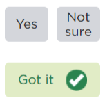

### Primary

Primary call-to-action. Used to differentiate the confirmation and sending of data. Title case.

  <button class="dci-button dci-button--primary">
    Normal State
  </button>

### Secondary

Secondary call-to-action. Used to confirm and progress to the next step. Title case

  <button class="dci-button dci-button--secondary">
    Normal State
  </button>
  &nbsp;
  <button class="dci-button dci-button--secondary dci-button--disabled">
    Inactive State
  </button>

### Tertiary

Tertiary call-to-action. Used to go back a step or exit form. Title case

  <button class="dci-button dci-button--tertiary">
    Normal State
  </button>

### Quarternary

Quaternary call-to-action. Used for micro interaction within a current step. E.g. edit or open & edit. Title case

  <button class="dci-button dci-button--quarternary">
    Normal State
  </button>

### Yes / No toggle

Conditional button. Enables user to confirm understanding a question or statement.
On selecting 'yes' the green 'Got it' state is displayed. This can trigger other screen elements (eg. activating secondary button.

Design debt on colouring

  <button class="dci-button dci-button--toggle">
    Yes
  </button>
  &nbsp;
  <button class="dci-button dci-button--toggle">
    Not sure
  </button>

TODO: remove dev notes?
## Dev notes

### Reference
[https://dev01.dev.services.melbourne.vic.gov.au/report/graffiti](https://dev01.dev.services.melbourne.vic.gov.au/report/graffiti)

### CSS Pulled form
- [dev01.dev.services.melbourne.vic.gov.au/css/site.css](dev01.dev.services.melbourne.vic.gov.au/css/site.css)
- [dev01.dev.services.melbourne.vic.gov.au/css/dci.report.common.css](dev01.dev.services.melbourne.vic.gov.au/css/dci.report.common.css)
