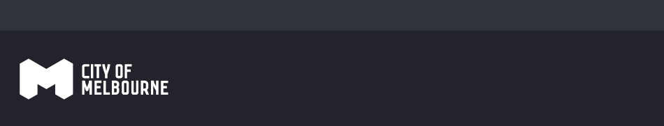
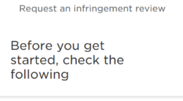

Welcome to the template page. I've laid out commonly used components so you can just copy this page when you want to create a new page for instance. Or as a reference for components, you know you'll find them here if you need them!
This is the page intro style. Just your standard body text.

## Header

### Desktop > 767px

At 768px and greater height increases, logo updates to larger format. Logo links to http://www.melbourne.vic.gov.au

### Mobile < 767px

At 767px wide and less, height decreases, logo updates to smaller format. Logo links to http://www.melbourne.vic.gov.au

## Page heading

Titles the service. Titles the current screen with overall theme of intent.

