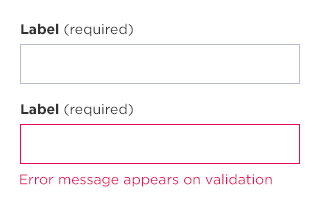
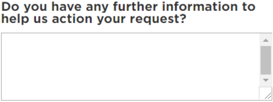
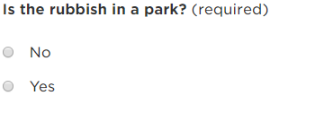
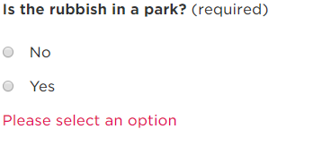
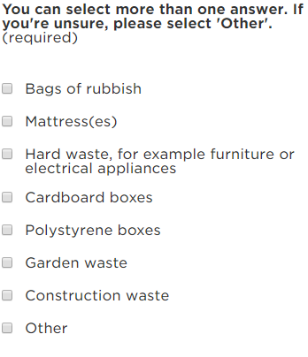
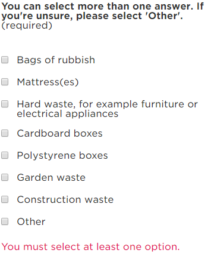

Browser display: __Desktop__ - Input displays at width: 355px, height: 38px; | __Mobile__ - Input displays at width: 300x, height: 38px;

## Single line text field - generic text capture

### Input and error
 

  <label class="font-bold"> Label </label> <label class="font-regular">(required)</label>
  
  <input type="text" id="test" class="dci-input-text" name="query">
    

  
  <label class="font-bold"> Label </label> <label class="font-regular">(required)</label>
 
  
    <input type="text" id="test" class="dci-input-text in-error" name="query">
    You must provide your email address or mobile number
    

  

  

### What it does 
- Captures text data, un-formatted.
- Displays error text upon validation rules not met when mandatory and marked as (required)

## Single line text field - mobile phone number capture

### What it does 
- Captures mobile phone numbers, formatted to standard AU mobile numbers
- Displays error text upon validation rules not met when mandatory and marked as (required)

### Validation Rules
- Must start with 04
- Must be numeric
- Must contain 10 digits

## Multi-line text field + description - generic text capture

### What it does 
- Captures any additional alpha numberic data
- Displays error text upon validation rules not met when mandatory and marked as (required)

### Input
  

### Error
## Dropdown list - selection capture
### What it does
### Input
### Error
## Radio button list - selection capture
### What it does
### Input
  
### Error
 
## Checkbox list - selection capture
### What it does 
- Captures multiple answers and helps direct the Case to a team or contractor.

### Input
  
### Error
 

