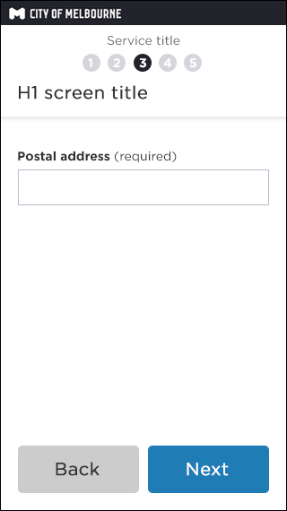
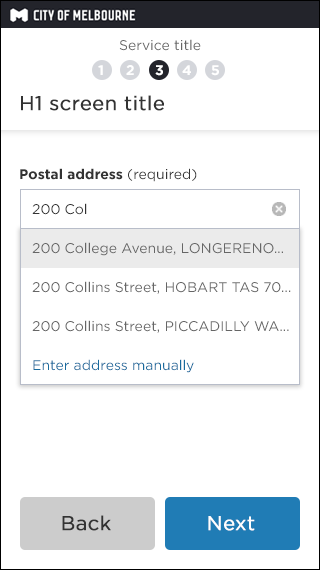
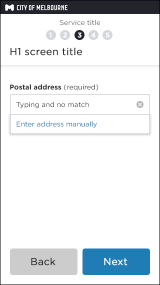
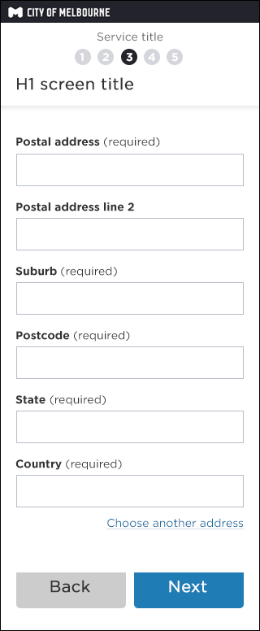

## What is it? 
__Captures customers address using a specific API;__  

- Sensi API - used for postal address capture
- Weave API - used for CoM property address
- Google API - fallback API when above not available

## How does this template work? 

__On load__   
One input field is displayed.  
This is because this module can be combined with others, which would create longer form fields to scan.

__On interaction - matched address value__
Addresses matching in drop down list.   
Customer can select an address from this list.

__On interaction - no matched address value__

__No address matched__  

Customer types 5 chars or more:

IF Customer enters an address string  
AND no match is found through the API  
THEN 'Enter address manually' link is displayed only  
AND customer can select this and display valid address   

__API unavailable__  

Scenario 1:

Customer types 5 chars or more:

IF Customer enters an address string  
AND loses focus of address field  
THEN address fields expand  
AND address data string is cleared  
AND Step 4 is displayed (via expand transition)

Scenario 2:

Customer types 5 chars + address string...

IF Customer enters an address string (no match)  
AND hits send/next button  
OR Hits enter key  
THEN address fields expand  
AND address data string is cleared  
AND validation rules occur  

__On selection of matched address__  

Full fields display as read only.  
This is because customers were editing address and invalidating the data. 

Choose another address - goes back to 'On load' (see above)

__Enter address manually__   
Clears fields and allows data input 

