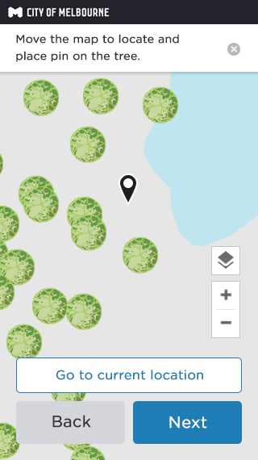
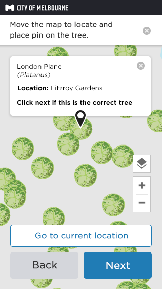
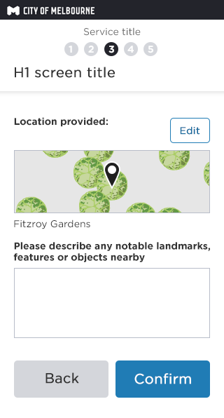
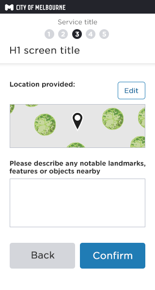

## What is it?
__Presents the customer options top provide a location OR specific asset location__  
The addition of spatial data ONLY changes the map UI and experience for the customer. 
Spatial data is loaded into the map and includes the coordinates of assets.
Each asset is represented with an icon. 
The design and background of this feature can be seen here.
Screen flows below show the map interaction

## Location - find on a map with spatial data (Weave API)

### 1.Provide a location using THE MAP

__Method of providing location or address__
Customer is presented with option to provide a known address or location.

__Buttons__
If the screen is the first step in the form, then one button spanning the full width is used - as above.
If the module is a step in the middle of a form flow, then 'Back' and 'Next' buttons are shown. 

### 2.Full screen map

__The full screen map__
On selecting 'Find on map' a full screen map is displayed, with a centered pin. 

On interaction the the map is movable, the pin remains static. 

__Spatial data__
Spatial data can be provided from the Weave API.Spatial data reveals assets. 
Assets are represented on the map using icons. 
Example above shows public trees (none selected)

__Location services__
__If location services ON__ (example above)
'Go to current location' button IS displayed above the 'close' and 'confirm' buttons. 

__If location services are OFF__
'Go to current location' button IS NOT displayed above the 'Back' and 'Confirm' buttons. 
The map location defaults to the town hall.

Selecting 'Back' takes the user back to the previous step. 

Selecting 'Next' takes the user to step 4 __'Confirming the data provided'__

### 3.Move map to pin - selecting an icon
__Selecting an icon__

When a customer selects an icon, an information panel is revealed, displaying data from the Weave API. (above example shows trees; tree name, genus name, location description and a call-to-action)

__Information panel display__
For any service, for consistency all information panels in this scenario should display:
- a title of the icon (what is it?)
- Location information
- The call-to-action - 'Select next if this is the correct <asset-name>'

### 4.Confirm location and optional info

__Confirming the data provided__
This step serves as a check point to review the location they have provided and an opportunity to provide additional written information about the location. 

Selecting 'Edit' opens the map full screen again.

__If icon HAS been selected:__
- map image displays
- location description displays under map image

And the customer can click 'confirm' to continue through the form.

### 5.Confirm location and optional info - no icon selected

__Confirming the data provided__
This step serves as a check point to review the location they have provided and an opportunity to provide additional written information about the location. 

Selecting 'Edit' opens the map full screen again.

__If icon HAS been selected:__
- map image displays
- location description displays under map image

And the customer can click 'confirm' to continue through the form.

## Location - type an address

### 1.Provide a location using THE ADDRESS MATCH

__Method of providing location or address__
Customer is presented with option to provide a known address or location.
__Buttons__
If the screen is the first step in the form, then one button spanning the full width is used - as above.
If the module is a step in the middle of a form flow, then 'Back' and 'Next' buttons are shown.

### 2.Matched address display

### 3.Matched address selected

### 4.Move map to pin 

__The full screen map__
On selecting 'Find on map' a full screen map is displayed, with a centered pin. 
On interaction the the map is movable, the pin remains static.
__Spatial data__
Spatial data can be provided from the Weave API.Spatial data reveals assets. 
Assets are represented on the map using icons. 
Example above shows public trees (none selected)

__Information panel display__
For any service, for consistency all information panels in this scenario should display:
- a title of the icon (what is it?)
- Location information
- The call-to-action - 'Select next if this is the correct <asset-name>'

__Location services__
If location services ON (example above)
'Go to current location' button IS displayed above the 'close' and 'confirm' buttons. 

__If location services are OFF__
'Go to current location' button IS NOT displayed above the 'Back' and 'Confirm' buttons. 
The map location defaults to the town hall.
Selecting 'Back' takes the user back to the previous step. 
Selecting 'Next' takes the user to step 4 __'Confirming the data provided'__

### 4.Confirm location and optional info

__Confirming the data provided__
This step serves as a check point to review the location they have provided and an opportunity to provide additional written information about the location. 

__Edit button__
Selecting 'Edit' opens the map full screen again.

__If icon HAS NOT been selected:__
- map image displays
- NO location description displays

__If icon HAS been selected:__
- map image displays
- location description displays under map image

See above steps for screens for both scenarios.
And the customer can click 'confirm' to continue through the form.

## Where is it used?

- __Graffiti__ [https://dev01.dev.services.melbourne.vic.gov.au/report/graffiti](https://dev01.dev.services.melbourne.vic.gov.au/report/graffiti)  __No__  
- __Tree Maintenance__ [https://dev01.dev.services.melbourne.vic.gov.au/report/treemaintenance](https://dev01.dev.services.melbourne.vic.gov.au/report/treemaintenance)  __Yes(Private trees part of the flow only )__
- __Abandoned Vehicle__ [https://dev01.dev.services.melbourne.vic.gov.au/report/abandonedvehicle ](https://dev01.dev.services.melbourne.vic.gov.au/report/abandonedvehicle )  __No__
- __Illegally Parked Vehicle__ [https://dev01.dev.services.melbourne.vic.gov.au/report/illegallyparkedvehicle](https://dev01.dev.services.melbourne.vic.gov.au/report/illegallyparkedvehicle)  __No__
- __Syringe Management__ [https://dev01.dev.services.melbourne.vic.gov.au/report/syringemanagement](https://dev01.dev.services.melbourne.vic.gov.au/report/syringemanagement)  __No__
- __Illegally Dumped Rubbish__ [https://dev01.dev.services.melbourne.vic.gov.au/report/illegallydumpedrubbish](https://dev01.dev.services.melbourne.vic.gov.au/report/illegallydumpedrubbish)  __No__
- __Rough Sleeping__ [https://dev01.dev.services.melbourne.vic.gov.au/tellus/online](https://dev01.dev.services.melbourne.vic.gov.au/tellus/online)  __No__
- __Parking Infringement Review__ [https://dev01.dev.services.melbourne.vic.gov.au/ask/infringementreview](https://dev01.dev.services.melbourne.vic.gov.au/ask/infringementreview)  __No__
- __Animal Infringement Review__ [https://dev01.dev.services.melbourne.vic.gov.au/ask/animals/infringementreview](https://dev01.dev.services.melbourne.vic.gov.au/ask/animals/infringementreview)  __No__
- __Local Law Infringement Review__ [https://dev01.dev.services.melbourne.vic.gov.au/ask/locallaws/infringement](https://dev01.dev.services.melbourne.vic.gov.au/ask/locallaws/infringement)  __No__
- __General Enquiry__ [https://dev01.dev.services.melbourne.vic.gov.au/ask/question](https://dev01.dev.services.melbourne.vic.gov.au/ask/question)  __No__