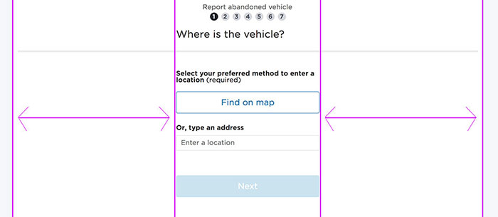

The first principle for layout is, "mobile first",so wherever possible,content should be stacked, rather than displayed side by side in.
### Single Column layout
The main content is centrally aligned, with space on either side.z
Bootstrap columns aren’t generally utilised in the DCI grid system, as the rule is that all components are stacked vertically. 

Only if content really needs to be shown side-by-side, do we use columns in bootstrap to display those items. An example of this is shown below:

### Content + Blocks

    

        <label class="font-bold"> Block Standard </label>
    

    

        <label class="font-bold"> Block Long </label>
    

    

        <label class="font-bold"> Block Longer </label>
    

    

        <button class="dci-button dci-button--primary">Primary</button>
    

### Exception: Column layout
There is an exception to the “mobile first, stacked layout” rule, and that is payment using the Westpac payment gateway. This requires input labels that are aligned to the left of input fields. This is the only time this should be used.

