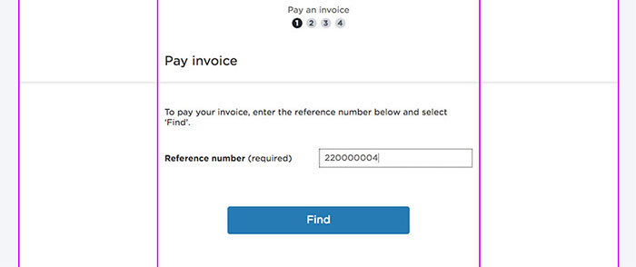

The first principle for layout is, "mobile first", so wherever possible, content should be stacked, rather than displayed side by side in.

### Single Column layout

The main content is centrally aligned, with space on either side. The max width for this main content is 355px, and when the viewport window is less than 768px, it breaks to 300px max width.

Bootstrap columns aren’t generally utilised in the DCI grid system, as the rule is that all components are stacked vertically. 

Only if content really needs to be shown side-by-side, do we use columns in bootstrap to display those items. An example of this is shown below:

### Raw Layout(Without Header and Footer)

    

        
Layout Example

        <section id="LocationStep" class="container wizard-step wizard-step-first ">
            <form class="steps-wizard" method="post" style="outline: 2px dashed #7a0c6c;width: 906px">
                

                    1
                    2
                    3
                    4
                    5
                    6
                

                

                    

                        
Title

                    

                    

                

                

                    <section class="location-sub-step">
                        
Lorem ipsum dolor sit amet, consectetur adipiscing elit. Nam placerat mauris sed nunc ultricies 

                        
Buttons Here

                    </section>
                

            </form>
        </section>
    

### Content + Blocks

        

            <label class="font-bold"> Block Standard </label>
        

        

            <label class="font-bold"> Block Long </label>
        

        

            <label class="font-bold"> Block Longer </label>
        

        

            <button class="dci-button dci-button--primary">Primary</button>
        

    

### Exception: Column layout

There is an exception to the “mobile first, stacked layout” rule, and that is payment using the Westpac payment gateway. This requires input labels that are aligned to the left of input fields. This is the only time this should be used.

